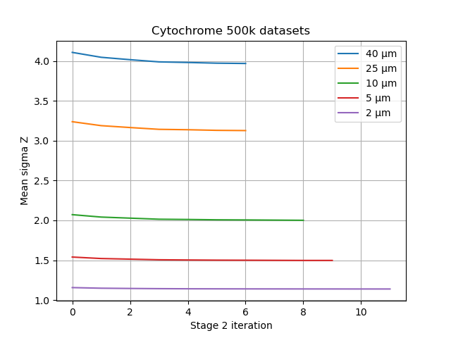
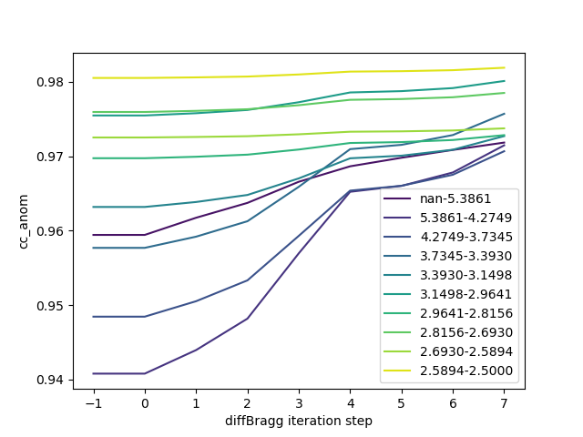

# ExaFEL evaluation

## Introduction

Directly citing the ExaFEL KPP-2 Writeup received from Nick, the quality
of results is to be evaluated using the following five figures of merit:

1) **A** – Geometrical fit between model and experiment;
2) **B** – Internal self-consistency of the intensity profile;
3) **C** – Precision of modeling the Bragg spot intensities;
4) **D** – Physical accuracy of the measurements;
5) **E** – Accuracy of the anomalous signal.

Individual figures of merit can be calculated using appropriate `.py` and `.sh`
scripts as discussed in section [Scripts](#scripts).
Each of these figures of merit is described further in the KPP write-up,
as well as in the [Google Docs file][link], accessible upon request.

[link]: https://docs.google.com/document/d/1XASZ3kjKgaWATuBiOGzjiwQWW8jlw6K4hY0wTtSOnNA


## Requirements

Running all ExaFEL evaluation scripts presented in this directory
requires a cctbx installation with the following modules and branches:

- `cctbx_project` – any recent branch
- `dials` – any recent branch (`dsp_oldstriping` suggested for processing)
- `exafel_project` – this branch
- `LS49` – any recent branch
- `ls49_big_data` – any recent branch
- `psii_spread` – any recent branch (optional)

If optional module `psii_spread` is used, the following git diff
must be applied to the `cctbx_project` module, independent on the branch used.
The cpp part is mostly irrelevant, so the cctbx does not need to be rebuilt
after introducing the patch.

```text
diff --git a/simtbx/diffBragg/src/diffBragg.cpp b/simtbx/diffBragg/src/diffBragg.cpp
index c7b1e08bc3..a893b423c7 100644
--- a/simtbx/diffBragg/src/diffBragg.cpp
+++ b/simtbx/diffBragg/src/diffBragg.cpp
@@ -1817,6 +1817,7 @@ void diffBragg::add_diffBragg_spots(const af::shared<size_t>& panels_fasts_slows

     Npix_to_model = panels_fasts_slows.size()/3;
    SCITBX_ASSERT(Npix_to_model <= Npix_total);
    +    raw_pixels_roi = af::flex_double(Npix_to_model); // NKS, only way to correctly size & zero array
     double * floatimage_roi = raw_pixels_roi.begin();

     diffBragg_rot_mats();
diff --git a/xfel/merging/command_line/merge.py b/xfel/merging/command_line/merge.py
index f045308541..0591ff200b 100644
--- a/xfel/merging/command_line/merge.py
+++ b/xfel/merging/command_line/merge.py
@@ -45,6 +45,7 @@ class Script(object):
   def __init__(self):
     self.mpi_helper = mpi_helper()
     self.mpi_logger = mpi_logger()
+    self.common_store = dict(foo="hello") # always volatile, no serialization, no particular dict keys guaranteed

   def __del__(self):
     self.mpi_helper.finalize()
@@ -165,6 +166,7 @@ class Script(object):
     # Perform phil validation up front
     for worker in workers:
       worker.validate()
+      worker.__dict__["common_store"] = self.common_store
     self.mpi_logger.log_step_time("CREATE_WORKERS", True)

     # Do the work
```


## Scripts
### Analysing offsets using diffBragg benchmark
*Associated goals*: **A**; *files:*
[evaluate_prediction_offset.py](evaluate_prediction_offset.py)

In order to evaluate the difference between reflection position offsets
calculated by diffBragg versus DIALS, the expanded diffBragg benchmark script
[evaluate_prediction_offset.py](evaluate_prediction_offset.py) can be used.
This code was originally introduced by Derek Mendez and further adapted
by Daniel Tchoń. It uses the information stored in .refl files after stage 1
to calculate radial, transverse, and overall offset across resolution bins.

The script can accept two different types of offset. If stage 1 has been run
in debug mode and produced expt/refl files, path to `stage1` output directory
can be provided:
```shell
libtbx.python $MODULES/exafel_project/kpp_eval/evaluate_prediction_offset.py \
    stage1=$SCRATCH/yb_lyso/13296752/stage1 d_min=2.0
```

If stage 1 expt/refls are not available, the information can be reconstructed
using the pickle file produced by `predict` (`diffBragg.integrate`) step.
In this case, the path to `predict` output directory must be specified:
```shell
libtbx.python $MODULES/exafel_project/kpp_eval/evaluate_prediction_offset.py \
    predict=$SCRATCH/cytochrome/1435064/predict d_min=1.5
```

Reading and processing all refl files takes a long time - up to hour for
1k events, depending on file sizes. It is advised to run the script using MPI
on a small but representative fraction of data only. Since running via `srun`
does not produce matplotlib interactive figures, the results can be pickled
and restored by running the command twice with `cache=cache.pkl`:
```shell
srun -q debug -A CHM137 -t 5 -N 1 -n 56 \
    libtbx.python $MODULES/exafel_project/kpp_eval/evaluate_prediction_offset.py \
    predict=$SCRATCH/cytochrome/1435064/predict d_min=1.5 fraction=0.01 cache=cache.pkl
libtbx.python $MODULES/exafel_project/kpp_eval/evaluate_prediction_offset.py cache=cache.pkl
```


By default, all data stored in read refls between `d_min` and `d_max`
will be grouped into `n_bins` and `stat=median` for each bin as well as
the entire range will be reported. Calculated statistic can be also set
to `average` (arithmetic mean) or `rms` (matches the annulus approach).
While ill-advised, `bins` can be made `same_count` to reflect the original
behavior of the script. In small cases, only `stage1` and `d_min` needs to be set.

### Analysing offsets using annulus worker
*Associated goals*: **A**; *files:*
[step_A1.sh](step_A1.sh), [step_A2.sh](step_A2.sh), 
[step_A3.sh](step_A3.sh), [step_A4.sh](step_A4.sh),
[fixup_hopper_identifiers.py](fixup_hopper_identifiers.py).

Other than using the dedicated script, offset rms can be also calculated
using the annulus worker deliverables code. This should be considered a backup
method. It can be achieved by copying and filling the environment variables
in shell scripts `step_A#.sh`, where # can be 1, 2, 3 or 4.
Steps 1 and 2 run the annulus worker on the common set of indexed DIALS (1)
and diffBragg (2) reflections. They collect information from the offset columns
to produce an average offset vs resolution table as a part of the main output.

```shell
cp $MODULES/exafel_project/kpp_eval/step_A1.sh .
vi step_A1.sh  # to fill the environment variables
sbatch step_A1.sh
```

Step 2 can be processed in the same way. If there are any problems mismatch
between stage 2 expt and refl identifiers, these can be most likely fixed
by appropriately fixing the files with `fixup_hopper_identifiers.py`.
Mind this analysis can be performed
on just a small subset of data, e.g. 3000 experiments.
In order to further analyse individual detector panels,
one can `cp`, edit and `source` steps 3 and 4 in a similar fashion.

This supplementary approach is available as a backup. It is slower
and provides less information than `evaluate_prediction_offset.py`.
Additionally, it relies on `psii_spread` module as dependency.
However, it might be preferable when focusing strictly on RMS,
scaling the evaluation to all data, or looking for more tested solution.

### Evaluating internal self-consistency of the intensity profile
*Associated goals*: **B**; *files:*
[evaluate_sigmaZ.py](evaluate_sigmaZ.py).

The self-consistency is already investigated by diffBragg in the form of
the uncertainty of the average Z-score for all modeled pixels.
This information is being printed in the stage 2 error file as such:
`RANK0000 | 2023-09-12 04:30:38,932 | F=2.9371969e+11, sigmaZ: mean=1.138858, median=1.135402`.

For convenience, a script for collecting and plotting this information
across multiple refinements as a function of stage 2 iteration is available
and can be run as following:
```shell
libtbx.python $MODULES/exafel_project/kpp_eval/evaluate_sigmaZ.py \
    err=job1.err err=job2.err err=job3.err err=job4.err err=job5.err
    labels="X1 μm,X2 μm,X3 μm,X4 μm,X5 μm" title="Sample 500k datasets"
```


### Evaluating cross-correlation of odd and even intensities
*Associated goals*: **C**; *files:*
[evaluate_cc12.py](evaluate_cc12.py),
[step_C.sh](step_C.sh).

Precision of intensities modeling has been proposed to utilise a difference
between "odd" and "even" half-sets of intensities refined by diffBragg.
Since stage 2 can produce an `.mtz` file, this can be done by calling
stage 2 refinement of half-datasets followed by a script that calculates
a cross-correlation coefficient between two such files,
called here `evaluate_cc12.py`. The python script can be called directly,
by providing mtz paths as arguments, or by calling a modified shell script:
```shell
libtbx.python $MODULES/exafel_project/kpp_eval/evaluate_cc12.py \
    mtz=path_to_stage2_odd.mtz \
    mtz=path_to_stage2_even.mtz \
    d_min=1.5
```

Alternatively, the same tool can be used via encapsulating script:
```shell
cp $MODULES/exafel_project/kpp_eval/step_C.sh .
vi step_C.sh  # to fill mtz paths
source step_C.sh
```

Mtz files can be readily obtained by running the convergence evaluation, see
[evaluate_stage2_convergence.py](evaluate_stage2_convergence.py) script and section
[Tracing the evolution of agreement parameters](#Tracing-the-evolution-of-agreement-parameters).

When evaluating simulated data, it is easier and scientifically
more reasonable to cross-correlate the entire dataset against
available reference data instead of comparing half-datasets.
This can be achieved by providing paths to reference and post-stage-2
mtz files instead of paths to half-dataset mtz files:
```shell
libtbx.python $MODULES/exafel_project/kpp_eval/evaluate_cc12.py d_min=1.5 \
    mtz=path_to_stage2.mtz \
    mtz=path_to_reference.mtz
```


### Calculating ground-truth R-factor and strength of anomalous signal
*Associated goals*: **D**, **E**;
*files:*
[evaluate_anom.py](evaluate_anom.py),
[step_DE.sh](step_DE.sh).

R-factor and anomalous signal strength can be automatically calculated
by loading reference `.pdb` and refined `.mtz` files using existing
`mmtbx.command_line.load_model_and_data`. The import step will automatically
print the "R_work" value, which in this case can be better described as "R_gt".
Anomalous map summary and peak heights for selected atoms will be then printed
for selected atoms using modified `xfel.peak_height_at_atom` call.
```shell
libtbx.python $MODULES/exafel_project/kpp_eval/evaluate_anom.py \
    path_to_reference.pdb \
    path_to_evaluated.mtz \
    selection="element Yb or element Fe or element Zn or element Ca"
```

Mtz files can be readily obtained by running the convergence evaluation, see
[evaluate_stage2_convergence.py](evaluate_stage2_convergence.py) script and section
[Tracing the evolution of agreement parameters](#Tracing-the-evolution-of-agreement-parameters).

Alternatively, the same tool can be used via encapsulating script:
```shell
cp $MODULES/exafel_project/kpp_eval/step_DE.sh .
vi step_DE.sh  # to fill pdb, mtz paths and anomalous element selection.
source step_DE.sh
```

In the case of pdb code 4bs7 (Ytterbium lysozyme), the results can be made
slightly more precise by importing exactly the same anomalous dispersion
parameters as the ones used to simulate the images. This can be done by
calling the dedicated `evaluate_anom_4bs7.py` script instead.

### Tracing the evolution of agreement parameters
*Associated goals*: **C**, **D**, **E**;
*files:*
[evaluate_stage2_convergence.py](evaluate_stage2_convergence.py).

Other than investigating the last step or output of diffBragg only,
the progress of stage 2 can be traced as a function of iteration step
using `evaluate_stage2_convergence.py`. This heavily modified version
of Vidya Ganapati's script can plot many aforementioned and other statistics,
as well as scatter refined vs reference data based on diffBragg `.npz` files.
It can be called directly with either a large set of phil parameters
(see example below and help message for full documentation) or by defining
appropriate environmental variables (see [kpp-docs/README.md](../kpp-docs/README.md)).

```shell
libtbx.ipython $MODULES/exafel_project/kpp_eval/evaluate_stage2_convergence.py \
    mtz=$SCRATCH/cytochrome/1427767/out/ly99sim_all.mtz
    stage2=$SCRATCH/cytochrome/1435064/1435064
    pdb=$MODULES/exafel_project/kpp-frontier/cytochrome/5wp2.pdb
    n_bins=10 d_min=1.5 stat=cc_anom scatter_ranges='-1:2,50:50:550' show=True
```

The script was initially not intended to be used as a stand-alone evaluation
tool, but it might prove useful as one, as it allows to calculate
statistics that are not yielded by other code, for example CC coefficient
between anomalous signals of the Friedel pairs.


## Cytochrome 500k Results

### **A** – Geometrical fit between model and experiment
The median offset of observed versus calculated reflection positions
after DIALS and diffBragg was calculated for randomly sampled 1%
of cytochrome 40 um and 2 um datasets using the following commands:
```shell
srun -q debug -A CHM137 -t 5 -N 1 -n 56 \
    libtbx.python $MODULES/exafel_project/kpp_eval/evaluate_prediction_offset.py
    predict=$SCRATCH/cytochrome/1435064/predict d_min=1.5 fraction=0.01 cache=cache40.pkl
srun -q debug -A CHM137 -t 5 -N 1 -n 56 \
    libtbx.python $MODULES/exafel_project/kpp_eval/evaluate_prediction_offset.py
    predict=$SCRATCH/cytochrome/1435711/predict d_min=1.5 fraction=0.01 cache=cache2.pkl
```

The median offset was found to be lower after diffBragg when compared to DIALS
for both crystal sizes. This improvement appears to come from a better modeling
of the unit cell. While the tangential offsets between the two refinement methods
tend to be similar, diffBragg excels at refining the radial component:

```text
cytochrome_40um DIALS_offset DIALS_rad  DIALS_tang  dB_offset    dB_rad   dB_tang  resolution
9999.0-3.2316      0.390506   0.261489    0.167189   0.303629  0.181084  0.143319    4.443697
3.2316-2.5649      0.487396   0.397316    0.145862   0.408709  0.301058  0.162405    2.864626
2.5649-2.2407      0.533542   0.440225    0.149865   0.441666  0.355837  0.160654    2.394721
2.2407-2.0358      0.543723   0.455068    0.158288   0.440177  0.352566  0.163321    2.139655
2.0358-1.8898      0.549702   0.459419    0.176970   0.444263  0.342623  0.176014    1.968886
1.8898-1.7784      0.571542   0.463743    0.216126   0.470298  0.342655  0.208306    1.839172
1.7784-1.6893      0.607055   0.476336    0.262552   0.504466  0.348213  0.253206    1.741373
1.6893-1.6158      0.657830   0.504403    0.315379   0.550037  0.369517  0.301263    1.662975
1.6158-1.5536      0.707130   0.528353    0.359942   0.593096  0.407544  0.334469    1.600215
1.5536-1.5000      0.763565   0.589546    0.401115   0.660018  0.392201  0.397764    1.545961
9999.0-1.5000      0.465678   0.351332    0.162644   0.377555  0.255948  0.159141    2.974422
```


```text
cytochrome_2um DIALS_offset  DIALS_rad  DIALS_tang  dB_offset    dB_rad   dB_tang  resolution
9999.0-3.2316      0.279141   0.179403    0.133202   0.276839  0.169079  0.141028    4.554702
3.2316-2.5649      0.312717   0.217776    0.140516   0.319637  0.217947  0.149169    2.949669
2.5649-2.2407      0.353423   0.249385    0.158226   0.339669  0.238407  0.154233    2.444139
2.2407-2.0358      0.410918   0.289611    0.187888   0.371555  0.261674  0.170714    2.194174
2.0358-1.8898      0.483057   0.293244    0.228578   0.425231  0.339507  0.190869    2.006121
9999.0-1.5000      0.287990   0.187879    0.135497   0.286907  0.179257  0.143073    4.119423
```


### **B** – Internal self-consistency of the intensity profile
The quality of modelling individual pixels can be assessed
by investigating the medium value of Z-score, i.e. the difference
between observed and simulated intensity at each individual pixels.
Should the model be able to perfectly describe the observation,
the value of said mean should approach 1.0 during refinement.
For cytochrome, the progress of mean Z-score refinement
has been summarized using the following command:
```shell
libtbx.python $MODULES/exafel_project/kpp_eval/evaluate_sigmaZ.py \
    err=1435087.err err=1434970.err err=1436811.err err=1435083.err err=1435719.err \
    labels="40 μm,25 μm,10 μm,5 μm,2 μm" title="Cytochrome 500k datasets"
```

Collected values suggest that diffBragg has difficulties with accurately
modelling particularly strong reflections (40 μm dataset). At the same time,
the signal from smaller crystal (2 μm dataset) appears to be described very
accurately, with mean uncertainty of Z-score reaching 1.13 during refinement.
```text
       40 μm     25 μm     10 μm      5 μm      2 μm
0   4.108914  3.238881  2.072005  1.539917  1.156392
1   4.047461  3.189280  2.041699  1.521272  1.148710
2   4.017326  3.165620  2.028229  1.513507  1.145507
3   3.989855  3.143123  2.014682  1.505691  1.143075
4   3.982375  3.138076  2.011481  1.503003  1.141479
5   3.973446  3.130381  2.007255  1.500919  1.140802
6   3.969796  3.127524  2.005594  1.499938  1.140124
7        NaN       NaN  2.003488  1.498627  1.139859
8        NaN       NaN  2.001198  1.497327  1.139471
9        NaN       NaN       NaN  1.497354  1.139276
10       NaN       NaN       NaN       NaN  1.138963
11       NaN       NaN       NaN       NaN  1.138858
```




### **C** – The precision of modeling intensities
The values of cross-correlation parameters between the reference
and diffBragg- or DIALS-refined structure factors were calculated
for cytochrome 40 um and 2 um datasets using the following commands:

```shell
# ground truth vs DIALS, 40 um dataset
libtbx.python $MODULES/exafel_project/kpp_eval/evaluate_cc12.py d_min=1.5 \
    mtz=$SCRATCH/cytochrome/1425204/ground_truth.mtz \
    mtz=$SCRATCH/cytochrome/1427767/out/ly99sim_all.mtz
# ground truth vs diffBragg, 40 um dataset
libtbx.python $MODULES/exafel_project/kpp_eval/evaluate_cc12.py d_min=1.5 \
    mtz=$SCRATCH/cytochrome/1425204/ground_truth.mtz \
    mtz=$SCRATCH/cytochrome/1435087/1435087/_fcell_trial0_call10_iter7.mtz
# ground truth vs DIALS, 2 um dataset
libtbx.python $MODULES/exafel_project/kpp_eval/evaluate_cc12.py d_min=1.5 \
    mtz=$SCRATCH/cytochrome/1429605/ground_truth.mtz \
    mtz=$SCRATCH/cytochrome/1429662/out/ly99sim_all.mtz
# ground truth vs diffBragg, 2 um dataset
libtbx.python $MODULES/exafel_project/kpp_eval/evaluate_cc12.py d_min=1.5 \
    mtz=$SCRATCH/cytochrome/1429605/ground_truth.mtz \
    mtz=$SCRATCH/cytochrome/1435719/1435719/_fcell_trial0_call15_iter12.mtz
```

Typically, values of cc above 90% would be considered very good
and values above 99% - excellent. The fact that cross-correlation parameter 
between ground truth and diffBragg-refined cytochrome data
remains excellent and drops monotonously across
the whole resolution range suggests unparalleled quality of the refinement.


```text
                     | 40 um dataset - DIALS         | 40 um dataset - diffBragg
    d_max     d_min  | #obs_asu / #thr_asu     cc_gt | #obs_asu / #thr_asu     cc_gt
---------------------+-------------------------------+------------------------------
( -1.0000,   3.2317) |    14311 /    14313  86.5356% |    14311 /    14313  99.7663%
(  3.2317,   2.5650) |    14338 /    14338  94.3500% |    14338 /    14338  99.9581%
(  2.5650,   2.2407) |    14312 /    14312  95.0250% |    14312 /    14312  99.9610%
(  2.2407,   2.0358) |    14304 /    14304  94.9788% |    14304 /    14304  99.9494%
(  2.0358,   1.8899) |    14314 /    14314  94.3438% |    14314 /    14314  99.9312%
(  1.8899,   1.7784) |    14315 /    14315  95.0106% |    14315 /    14315  99.9034%
(  1.7784,   1.6894) |    14311 /    14311  94.6722% |    14311 /    14311  99.9159%
(  1.6894,   1.6158) |    14318 /    14318  95.3610% |    14318 /    14318  99.9007%
(  1.6158,   1.5536) |    14319 /    14319  94.9524% |    14319 /    14319  99.8234%
(  1.5536,   1.5000) |    14297 /    14297  93.8292% |    14297 /    14297  99.6490%
---------------------+-------------------------------+------------------------------
( -1.0000,   1.5000) |   143139 /   143141  84.8932% |   143139 /   143141  99.9182%
```

```text
                     | 2 um dataset - DIALS          | 2 um dataset - diffBragg
    d_max     d_min  | #obs_asu / #thr_asu     cc_gt | #obs_asu / #thr_asu     cc_gt
---------------------+-------------------------------+------------------------------
( -1.0000,   2.9666) |    14311 /    14313  89.3930% |    14311 /    14313  99.6324%
(  2.9666,   2.3546) |    14338 /    14338  93.7495% |    14338 /    14338  99.9072%
(  2.3546,   2.0569) |    14312 /    14312  94.0065% |    14312 /    14312  99.8907%
(  2.0569,   1.8688) |    14304 /    14304  93.6161% |    14304 /    14304  99.7294%
(  1.8688,   1.7349) |    14314 /    14314  92.5871% |    14314 /    14314  99.5566%
(  1.7349,   1.6326) |    14315 /    14315  93.5643% |    14315 /    14315  98.6939%
(  1.6326,   1.5508) |    14311 /    14311  91.9421% |    14311 /    14311  96.2431%
(  1.5508,   1.4833) |    14318 /    14318  83.9086% |    14318 /    14318  80.7115%
(  1.4833,   1.4262) |    14318 /    14319  35.4283% |    14318 /    14319  35.7660%
(  1.4262,   1.3770) |    10192 /    14297   9.5000% |    10192 /    14297  10.1651%
---------------------+-------------------------------+------------------------------
( -1.0000,   1.3770) |   139033 /   143141  85.4463% |   139033 /   143141  98.9107%
```

*Note: these DIALS values seem surprisingly poor. I spent some
time trying to find out the reason, especially since the same formula
is used in the convergence script, but could not come to conclusion.
Unless you can prove the DIALS results are correct, I would advise
to use diffBragg results only. / Daniel*

### **D & E** – Accuracy of measurement and anomalous signal
The following scripts were run in order to evaluate the values of R-factor
and anomalous signal on iron and sulphur metals in DIALS- and diffBragg-
refined mtz files for datasets cytochrome 500k 40 um and 2 um:

```shell
# DIALS-refined structure factors, cytochrome 500k 40 um
libtbx.python $MODULES/exafel_project/kpp_eval/evaluate_anom.py \
    $MODULES/exafel_project/kpp-frontier/cytochrome/5wp2.pdb \
    $SCRATCH/cytochrome/1427767/out/ly99sim_all.mtz \
    selection="element Fe or element S"
# diffBragg-refined factors, cytochrome 500k 40 um
libtbx.python $MODULES/exafel_project/kpp_eval/evaluate_anom.py \
    $MODULES/exafel_project/kpp-frontier/cytochrome/5wp2.pdb \
    $SCRATCH/cytochrome/1435087/1435087/_fcell_trial0_call10_iter7.mtz \
    selection="element Fe or element S"
# DIALS-refined structure factors, cytochrome 500k 2 um
libtbx.python $MODULES/exafel_project/kpp_eval/evaluate_anom.py \
    $MODULES/exafel_project/kpp-frontier/cytochrome/5wp2.pdb \
    $SCRATCH/cytochrome/1429662/out/ly99sim_all.mtz \
    selection="element Fe or element S"
# diffBragg-refined factors, cytochrome 500k 2 um
libtbx.python $MODULES/exafel_project/kpp_eval/evaluate_anom.py \
    $MODULES/exafel_project/kpp-frontier/cytochrome/5wp2.pdb \
    $SCRATCH/cytochrome/1435719/1435719/_fcell_trial0_call15_iter12.mtz \
    selection="element Fe or element S"
```

The resulting values for cytochrome 40 um dataset are very similar,
suggesting both DIALS- and diffBragg- refined structure factors
can be effectively used to solve phase problem and
refine a final crystal structure. In the case of 2 um,
diffBragg does not improve the results obtained initially by DIALS.

```text
DIALS, cytochrome 40 um dataset
                   start: r(all,work,free)=0.1899 0.1899 0.1899 n_refl.: 142290
       re-set all scales: r(all,work,free)=0.1899 0.1899 0.1899 n_refl.: 142290
         remove outliers: r(all,work,free)=0.1893 0.1893 0.1893 n_refl.: 142283
bulk-solvent and scaling: r(all,work,free)=0.0332 0.0332 0.0332 n_refl.: 142283
         remove outliers: r(all,work,free)=0.0332 0.0332 0.0332 n_refl.: 142283
|--(resolution: 1.50 - 60.05 A, n_refl.=142283 (all), 100.00% free)-----------|
|                                                                             |
| r_work= 0.0332 r_free= 0.0332 coordinate error (max.-lik. estimate): 0.08 A |
|                                                                             |
| normalized target function (ml) (work): 3.667821                            |
| target function (ml) not normalized (work): 521868.505105                   |
| target function (ml) not normalized (free):            None                 |
|-----------------------------------------------------------------------------|

pdb=" SG  CYS A  51 ":  24.81σ
pdb=" SD AMET A  62 ":  14.92σ
pdb=" SD BMET A  62 ":   6.77σ
pdb=" SD AMET A  86 ":  11.71σ
pdb=" SD BMET A  86 ":   7.91σ
pdb=" SD AMET A  99 ":   9.71σ
pdb=" SD BMET A  99 ":   5.35σ
pdb=" SG  CYS A 147 ":  23.70σ
pdb=" SD  MET A 169 ":  31.91σ
pdb=" SD  MET A 189 ":  22.90σ
pdb=" SD  MET A 203 ":  21.86σ
pdb=" SG  CYS A 345 ":  28.03σ
pdb=" SD  MET A 366 ":  20.82σ
pdb="FE   HEM A 401 ": 204.27σ
pdb=" S   SO4 A 404 ":   7.05σ
pdb=" S   SO4 A 405 ":  10.94σ
pdb=" S   SO4 A 406 ":   6.17σ
pdb=" S   SO4 A 407 ":   4.29σ
```

```text
diffBragg, cytochrome 40 um dataset
                   start: r(all,work,free)=0.1800 0.1800 0.1800 n_refl.: 143188
       re-set all scales: r(all,work,free)=0.1800 0.1800 0.1800 n_refl.: 143188
         remove outliers: r(all,work,free)=0.1788 0.1788 0.1788 n_refl.: 143175
bulk-solvent and scaling: r(all,work,free)=0.0328 0.0328 0.0328 n_refl.: 143175
         remove outliers: r(all,work,free)=0.0328 0.0328 0.0328 n_refl.: 143175
|--(resolution: 1.50 - 60.03 A, n_refl.=143175 (all), 100.00% free)-----------|
|                                                                             |
| r_work= 0.0328 r_free= 0.0328 coordinate error (max.-lik. estimate): 0.08 A |
|                                                                             |
| normalized target function (ml) (work): 3.512417                            |
| target function (ml) not normalized (work): 502890.347754                   |
| target function (ml) not normalized (free):            None                 |
|-----------------------------------------------------------------------------|

pdb=" SG  CYS A  51 ":  24.67σ
pdb=" SD AMET A  62 ":  14.91σ
pdb=" SD BMET A  62 ":   6.83σ
pdb=" SD AMET A  86 ":  11.84σ
pdb=" SD BMET A  86 ":   7.88σ
pdb=" SD AMET A  99 ":   9.72σ
pdb=" SD BMET A  99 ":   5.35σ
pdb=" SG  CYS A 147 ":  23.65σ
pdb=" SD  MET A 169 ":  31.88σ
pdb=" SD  MET A 189 ":  22.71σ
pdb=" SD  MET A 203 ":  21.65σ
pdb=" SG  CYS A 345 ":  28.80σ
pdb=" SD  MET A 366 ":  21.17σ
pdb="FE   HEM A 401 ": 203.90σ
pdb=" S   SO4 A 404 ":   7.09σ
pdb=" S   SO4 A 405 ":  10.92σ
pdb=" S   SO4 A 406 ":   6.12σ
pdb=" S   SO4 A 407 ":   4.34σ
```

```text
DIALS, cytochrome 2 um dataset
                   start: r(all,work,free)=0.1811 0.1811 0.1811 n_refl.: 138612
       re-set all scales: r(all,work,free)=0.1811 0.1811 0.1811 n_refl.: 138612
         remove outliers: r(all,work,free)=0.1806 0.1806 0.1806 n_refl.: 138605
bulk-solvent and scaling: r(all,work,free)=0.0748 0.0748 0.0748 n_refl.: 138605
         remove outliers: r(all,work,free)=0.0748 0.0748 0.0748 n_refl.: 138605
|--(resolution: 1.50 - 60.05 A, n_refl.=138605 (all), 100.00% free)-----------|
|                                                                             |
| r_work= 0.0748 r_free= 0.0748 coordinate error (max.-lik. estimate): 0.19 A |
|                                                                             |
| normalized target function (ml) (work): 4.557598                            |
| target function (ml) not normalized (work): 631705.898414                   |
| target function (ml) not normalized (free):            None                 |
|-----------------------------------------------------------------------------|

pdb=" SG  CYS A  51 ":   8.26σ
pdb=" SD AMET A  62 ":   5.52σ
pdb=" SD BMET A  62 ":   1.20σ
pdb=" SD AMET A  86 ":   2.66σ
pdb=" SD BMET A  86 ":   2.71σ
pdb=" SD AMET A  99 ":   2.41σ
pdb=" SD BMET A  99 ":   0.93σ
pdb=" SG  CYS A 147 ":   8.21σ
pdb=" SD  MET A 169 ":   9.45σ
pdb=" SD  MET A 189 ":   6.66σ
pdb=" SD  MET A 203 ":   8.47σ
pdb=" SG  CYS A 345 ":   8.58σ
pdb=" SD  MET A 366 ":   9.28σ
pdb="FE   HEM A 401 ":  63.77σ
pdb=" S   SO4 A 404 ":   1.35σ
pdb=" S   SO4 A 405 ":   3.60σ
pdb=" S   SO4 A 406 ":   3.45σ
pdb=" S   SO4 A 407 ":  -0.30σ
```

```text
diffBragg, cytochrome 2 um dataset
                   start: r(all,work,free)=0.1913 0.1913 0.1913 n_refl.: 139058
       re-set all scales: r(all,work,free)=0.1913 0.1913 0.1913 n_refl.: 139058
         remove outliers: r(all,work,free)=0.1902 0.1902 0.1902 n_refl.: 139046
bulk-solvent and scaling: r(all,work,free)=0.0939 0.0939 0.0939 n_refl.: 139046
         remove outliers: r(all,work,free)=0.0939 0.0939 0.0939 n_refl.: 139046
|--(resolution: 1.50 - 60.03 A, n_refl.=139046 (all), 100.00% free)-----------|
|                                                                             |
| r_work= 0.0939 r_free= 0.0939 coordinate error (max.-lik. estimate): 0.25 A |
|                                                                             |
| normalized target function (ml) (work): 4.443050                            |
| target function (ml) not normalized (work): 617788.378315                   |
| target function (ml) not normalized (free):            None                 |
|-----------------------------------------------------------------------------|

pdb=" SG  CYS A  51 ":   3.06σ
pdb=" SD AMET A  62 ":   1.74σ
pdb=" SD BMET A  62 ":  -1.00σ
pdb=" SD AMET A  86 ":   0.31σ
pdb=" SD BMET A  86 ":   0.70σ
pdb=" SD AMET A  99 ":   0.50σ
pdb=" SD BMET A  99 ":   0.77σ
pdb=" SG  CYS A 147 ":   2.58σ
pdb=" SD  MET A 169 ":   3.38σ
pdb=" SD  MET A 189 ":   2.50σ
pdb=" SD  MET A 203 ":   2.95σ
pdb=" SG  CYS A 345 ":   3.57σ
pdb=" SD  MET A 366 ":   4.76σ
pdb="FE   HEM A 401 ":  26.49σ
pdb=" S   SO4 A 404 ":   0.58σ
pdb=" S   SO4 A 405 ":   0.80σ
pdb=" S   SO4 A 406 ":   1.86σ
pdb=" S   SO4 A 407 ":  -1.23σ
```

*Note: Small sample might give worse results here because it uses
relatively worse sigma Z cutoff. While the average Z score for 40 um
is 4x larger than for 2 um dataset, the Z-score limit used in both refinements
is the same, while it should probably be appropriately reduced. / Daniel*

### **C, D & E** – Tracing the evolution of agreement parameters
DiffBragg utilizes DIALS as a starting point for its refinement.
The final values are also very similar. For this reason, there is little
point in observing the evolution of total structure factors as a function
of diffBragg iteration step. However, the evolution of anomalous part
of the low-resolution structure factors exhibits interesting trends,
as revealed by the following script:

```shell
libtbx.ipython $MODULES/exafel_project/kpp_eval/evaluate_stage2_convergence.py \
    mtz=$SCRATCH/cytochrome/1427767/out/ly99sim_all.mtz \
    stage2=$SCRATCH/cytochrome/1435087/1435087 \
    pdb=$MODULES/exafel_project/kpp-frontier/cytochrome/5wp2.pdb \
    n_bins=10 d_min=2.5 stat=cc_anom show=True
```



DiffBragg appears to be slightly better than DIALS in evaluation of
low-resolution intensities, resulting in more accurate anomalous signals
refined in this region. The same effect can be observed for crystal size 25 um,
but unfortunately appears to be lost for weaker, 2 um dataset.