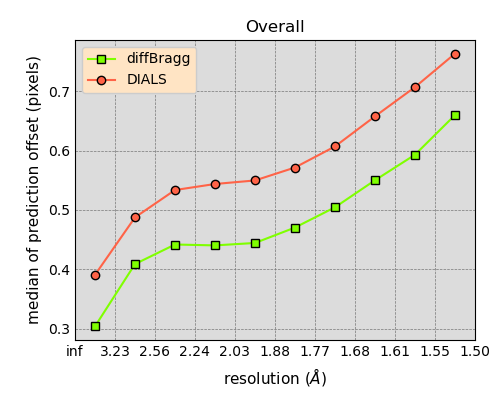
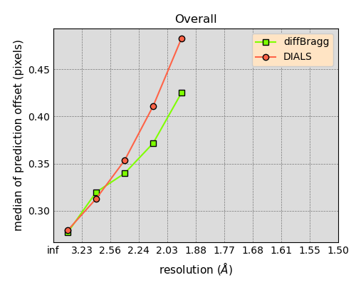

# ExaFEL evaluation

## Introduction

Directly citing the ExaFEL KPP-2 Writeup received from Nick, the quality
of results is to be evaluated using the following five figures of merit:

1) **A** – Geometrical fit between model and experiment;
2) **B** – Internal self-consistency of the intensity profile;
3) **C** – Precision of modeling the Bragg spot intensities;
4) **D** – Physical accuracy of the measurements;
5) **E** – Accuracy of the anomalous signal.

Individual figures of merit can be calculated using appropriate `.py` and `.sh`
scripts as discussed in section [Scripts](#scripts).
Each of these figures of merit is described further in the KPP write-up,
as well as in the [Google Docs file][link], accessible upon request.

[link]: https://docs.google.com/document/d/1XASZ3kjKgaWATuBiOGzjiwQWW8jlw6K4hY0wTtSOnNA


## Requirements

Running all ExaFEL evaluation scripts presented in this directory
requires a cctbx installation with the following modules and branches:

- `cctbx_project` – any recent branch
- `dials` – any recent branch (`dsp_oldstriping` suggested for processing)
- `exafel_project` – this branch
- `LS49` – any recent branch
- `ls49_big_data` – any recent branch
- `psii_spread` – any recent branch (optional)

If optional module `psii_spread` is used, the following git diff
must be applied to the `cctbx_project` module, independent on the branch used.
The cpp part is mostly irrelevant, so the cctbx does not need to be rebuilt
after introducing the patch.

```text
diff --git a/simtbx/diffBragg/src/diffBragg.cpp b/simtbx/diffBragg/src/diffBragg.cpp
index c7b1e08bc3..a893b423c7 100644
--- a/simtbx/diffBragg/src/diffBragg.cpp
+++ b/simtbx/diffBragg/src/diffBragg.cpp
@@ -1817,6 +1817,7 @@ void diffBragg::add_diffBragg_spots(const af::shared<size_t>& panels_fasts_slows

     Npix_to_model = panels_fasts_slows.size()/3;
    SCITBX_ASSERT(Npix_to_model <= Npix_total);
    +    raw_pixels_roi = af::flex_double(Npix_to_model); // NKS, only way to correctly size & zero array
     double * floatimage_roi = raw_pixels_roi.begin();

     diffBragg_rot_mats();
diff --git a/xfel/merging/command_line/merge.py b/xfel/merging/command_line/merge.py
index f045308541..0591ff200b 100644
--- a/xfel/merging/command_line/merge.py
+++ b/xfel/merging/command_line/merge.py
@@ -45,6 +45,7 @@ class Script(object):
   def __init__(self):
     self.mpi_helper = mpi_helper()
     self.mpi_logger = mpi_logger()
+    self.common_store = dict(foo="hello") # always volatile, no serialization, no particular dict keys guaranteed

   def __del__(self):
     self.mpi_helper.finalize()
@@ -165,6 +166,7 @@ class Script(object):
     # Perform phil validation up front
     for worker in workers:
       worker.validate()
+      worker.__dict__["common_store"] = self.common_store
     self.mpi_logger.log_step_time("CREATE_WORKERS", True)

     # Do the work
```


## Scripts
### Analysing offsets using diffBragg benchmark
*Associated goals*: **A**; *files:*
[evaluate_prediction_offset.py](evaluate_prediction_offset.py)

In order to evaluate the difference between reflection position offsets
calculated by diffBragg versus DIALS, the expanded diffBragg benchmark script
[evaluate_prediction_offset.py](evaluate_prediction_offset.py) can be used.
This code was originally introduced by Derek Mendez and further adapted
by Daniel Tchoń. It uses the information stored in .refl files after stage 1
to calculate radial, transverse, and overall offset across resolution bins.

The script can accept two different types of offset. If stage 1 has been run
in debug mode and produced expt/refl files, path to `stage1` output directory
can be provided:
```shell
libtbx.python $MODULES/exafel_project/kpp_eval/evaluate_prediction_offset.py \
    stage1=$SCRATCH/yb_lyso/13296752/stage1 d_min=2.0
```

If stage 1 expt/refls are not available, the information can be reconstructed
using the pickle file produced by `predict` (`diffBragg.integrate`) step.
In this case, the path to `predict` output directory must be specified:
```shell
libtbx.python $MODULES/exafel_project/kpp_eval/evaluate_prediction_offset.py \
    predict=$SCRATCH/cytochrome/1435064/predict d_min=1.5
```

Reading and processing all refl files takes a long time - up to hour for
1k events, depending on file sizes. It is advised to run the script using MPI
on a small but representative fraction of data only. Since running via `srun`
does not produce matplotlib interactive figures, the results can be pickled
and restored by running the command twice with `cache=cache.pkl`:
```shell
srun -q debug -A CHM137 -t 5 -N 1 -n 56 \
    libtbx.python $MODULES/exafel_project/kpp_eval/evaluate_prediction_offset.py \
    predict=$SCRATCH/cytochrome/1435064/predict d_min=1.5 fraction=0.01 cache=cache.pkl
libtbx.python $MODULES/exafel_project/kpp_eval/evaluate_prediction_offset.py cache=cache.pkl
```


By default, all data stored in read refls between `d_min` and `d_max`
will be grouped into `n_bins` and `stat=median` for each bin as well as
the entire range will be reported. Calculated statistic can be also set
to `average` (arithmetic mean) or `rms` (matches the annulus approach).
While ill-advised, `bins` can be made `same_count` to reflect the original
behavior of the script. In small cases, only `stage1` and `d_min` needs to be set.

### Analysing offsets using annulus worker
*Associated goals*: **A**; *files:*
[step_A1.sh](step_A1.sh), [step_A1.sh](step_A1.sh), 
[step_A1.sh](step_A3.sh), [step_A1.sh](step_A4.sh),
[fixup_hopper_identifiers.py](fixup_hopper_identifiers.py).

Other than using the dedicated script, offset rms can be also calculated
using the annulus worker deliverables code. This should be considered a backup
method. It can be achieved by copying and filling the environment variables
in shell scripts `step_A#.sh`, where # can be 1, 2, 3 or 4.
Steps 1 and 2 run the annulus worker on the common set of indexed DIALS (1)
and diffBragg (2) reflections. They collect information from the offset columns
to produce an average offset vs resolution table as a part of the main output.

```shell
cp $MODULES/exafel_project/kpp_eval/step_A1.sh .
vi step_A1.sh  # to fill the environment variables
sbatch step_A1.sh
```

Step 2 can be processed in the same way. If there are any problems mismatch
between stage 2 expt and refl identifiers, these can be most likely fixed
by appropriately fixing the files with `fixup_hopper_identifiers.py`.
Mind this analysis can be performed
on just a small subset of data, e.g. 3000 experiments.
In order to further analyse individual detector panels,
one can `cp`, edit and `source` steps 3 and 4 in a similar fashion.

This supplementary approach is available as a backup. It is slower
and provides less information than `evaluate_prediction_offset.py`.
Additionally, it relies on `psii_spread` module as dependency.
However, it might be preferable when focusing strictly on RMS,
scaling the evaluation to all data, or looking for more tested solution.

### Evaluating cross-correlation of odd and even intensities
*Associated goals*: **C**; *files:*
[evaluate_cc12.py](evaluate_cc12.py),
[step_C.sh](step_C.sh).

Precision of intensities modeling has been proposed to utilise a difference
between "odd" and "even" half-sets of intensities refined by diffBragg.
Since stage 2 can produce an `.mtz` file, this can be done by calling
stage 2 refinement of half-datasets followed by a script that calculates
a cross-correlation coefficient between two such files,
called here `evaluate_cc12.py`. The python script can be called directly,
by providing mtz paths as arguments, or by calling a modified shell script:
```shell
libtbx.python "$MODULES"/exafel_project/kpp_eval/evaluate_cc12.py \
    mtz=path_to_stage2_odd.mtz \
    mtz=path_to_stage2_even.mtz
    
```

Alternatively, the same tool can be used via encapsulating script:
```shell
cp $MODULES/exafel_project/kpp_eval/step_C.sh .
vi step_C.sh  # to fill mtz paths
source step_C.sh
```

When evaluating simulated data, it is easier and scientifically
more reasonable to cross-correlate the entire dataset against
available reference data instead of comparing half-datasets.
This can be achieved by providing paths to reference and post-stage-2
mtz files instead of paths to half-dataset mtz files:
```shell
libtbx.python "$MODULES"/exafel_project/kpp_eval/evaluate_cc12.py \
    mtz=path_to_stage2.mtz \
    mtz=path_to_reference.mtz
```


### Calculating ground-truth R-factor and strength of anomalous signal
*Associated goals*: **D**, **E**;
*files:*
[evaluate_anom.py](evaluate_anom.py),
[step_DE.sh](step_DE.sh).

R-factor and anomalous signal strength can be automatically calculated
by loading reference `.pdb` and refined `.mtz` files using existing
`mmtbx.command_line.load_model_and_data`. The import step will automatically
print the "R_work" value, which in this case can be better described as "R_gt".
Anomalous map summary and peak heights for selected atoms will be then printed
for selected atoms using modified `xfel.peak_height_at_atom` call.
```shell
libtbx.python "$MODULES"/exafel_project/kpp_eval/evaluate_anom.py \
    path_to_reference.pdb \
    path_to_evaluated.mtz \
    selection="element Yb or element Fe or element Zn or element Ca"
```

Alternatively, the same tool can be used via encapsulating script:
```shell
cp $MODULES/exafel_project/kpp_eval/step_DE.sh .
vi step_DE.sh  # to fill pdb, mtz paths and anomalous element selection.
source step_DE.sh
```

In the case of pdb code 4bs7 (Ytterbium lysozyme), the results can be made
slightly more precise by importing exactly the same anomalous dispersion
parameters as the ones used to simulate the images. This can be done by
calling the dedicated `evaluate_anom_4bs7.py` script instead.

### Tracing the evolution of agreement parameters
*Associated goals*: **C**, **D**, **E**;
*files:*
[evaluate_stage2_convergence.py](evaluate_stage2_convergence.py).

Other than investigating the last step or output of diffBragg only,
the progress of stage 2 can be traced as a function of iteration step
using `evaluate_stage2_convergence.py`. This heavily modified version
of Vidya Ganapati's script can plot many aforementioned and other statistics,
as well as scatter refined vs reference data based on diffBragg `.npz` files.
It can be called directly with either a large set of phil parameters
(see example below and help message for full documentation) or by defining
appropriate environmental variables (see [README.md](../kpp-docs/README.md)).

```shell
libtbx.ipython $MODULES/exafel_project/kpp_eval/evaluate_stage2_convergence.py \
    mtz=$SCRATCH/cytochrome/1427767/out/ly99sim_all.mtz
    stage2=$SCRATCH/cytochrome/1435064/1435064
    pdb=$MODULES/exafel_project/kpp-frontier/cytochrome/5wp2.pdb
    n_bins=10 d_min=1.5 stat=cc_anom scatter_ranges='-1:2,50:50:550' show=True
```

The script was initially not intended to be used as a stand-alone evaluation
tool, but it might prove useful as one, as it allows to calculate
statistics that are not yielded by other code, for example CC coefficient
between anomalous signals of the Friedel pairs.


## Cytochrome 500k Results

### **A** – Geometrical fit between model and experiment
The median offset of observed versus calculated reflection positions
after DIALS and diffBragg was calculated for randomly sampled 1%
of cytochrome 40 um and 2 um datasets using the following commands:
```shell
srun -q debug -A CHM137 -t 5 -N 1 -n 56 \
    libtbx.python $MODULES/exafel_project/kpp_eval/evaluate_prediction_offset.py
    predict=$SCRATCH/cytochrome/1435064/predict d_min=1.5 fraction=0.01 cache=cache40.pkl
srun -q debug -A CHM137 -t 5 -N 1 -n 56 \
    libtbx.python $MODULES/exafel_project/kpp_eval/evaluate_prediction_offset.py
    predict=$SCRATCH/cytochrome/1435711/predict d_min=1.5 fraction=0.01 cache=cache2.pkl
```

The median offset was found to be lower after diffBragg when compared to DIALS
for both crystal sizes. This improvement appears to come from a better modeling
of the unit cell. While the tangential offsets between the two refinement methods
tend to be similar, diffBragg excels at refining the radial component:

```text
cytochrome_40um DIALS_offset DIALS_rad  DIALS_tang  dB_offset    dB_rad   dB_tang  resolution
9999.0-3.2316      0.390506   0.261489    0.167189   0.303629  0.181084  0.143319    4.443697
3.2316-2.5649      0.487396   0.397316    0.145862   0.408709  0.301058  0.162405    2.864626
2.5649-2.2407      0.533542   0.440225    0.149865   0.441666  0.355837  0.160654    2.394721
2.2407-2.0358      0.543723   0.455068    0.158288   0.440177  0.352566  0.163321    2.139655
2.0358-1.8898      0.549702   0.459419    0.176970   0.444263  0.342623  0.176014    1.968886
1.8898-1.7784      0.571542   0.463743    0.216126   0.470298  0.342655  0.208306    1.839172
1.7784-1.6893      0.607055   0.476336    0.262552   0.504466  0.348213  0.253206    1.741373
1.6893-1.6158      0.657830   0.504403    0.315379   0.550037  0.369517  0.301263    1.662975
1.6158-1.5536      0.707130   0.528353    0.359942   0.593096  0.407544  0.334469    1.600215
1.5536-1.5000      0.763565   0.589546    0.401115   0.660018  0.392201  0.397764    1.545961
9999.0-1.5000      0.465678   0.351332    0.162644   0.377555  0.255948  0.159141    2.974422
```



```text
cytochrome_2um DIALS_offset  DIALS_rad  DIALS_tang  dB_offset    dB_rad   dB_tang  resolution
9999.0-3.2316      0.279141   0.179403    0.133202   0.276839  0.169079  0.141028    4.554702
3.2316-2.5649      0.312717   0.217776    0.140516   0.319637  0.217947  0.149169    2.949669
2.5649-2.2407      0.353423   0.249385    0.158226   0.339669  0.238407  0.154233    2.444139
2.2407-2.0358      0.410918   0.289611    0.187888   0.371555  0.261674  0.170714    2.194174
2.0358-1.8898      0.483057   0.293244    0.228578   0.425231  0.339507  0.190869    2.006121
9999.0-1.5000      0.287990   0.187879    0.135497   0.286907  0.179257  0.143073    4.119423
```



### **C** – The precision of modeling intensities

The script for calculating cc1/2 between two half-sets of data refined
by diffBragg is ready and available. It hasn't been used to test the agreement
of the half-sets yet, but it was used to test the agreement between 
DIALS and stage2 refinements. The results show good agreement
at medium-resolution range and decent agreement in low- and high-resolution.
This agrees with conclusions from other tests performed here.

```text
    d_max     d_min  #obs_asu / #thr_asu    cc1/2
--------------------------------------------------
( -1.0000,   4.3082)     1575 /     1580  82.2677%
(  4.3082,   3.4194)     1575 /     1575  94.5610%
(  3.4194,   2.9871)     1585 /     1585  92.9034%
(  2.9871,   2.7140)     1570 /     1570  94.7748%
(  2.7140,   2.5194)     1569 /     1569  94.6731%
(  2.5194,   2.3709)     1575 /     1575  92.8068%
(  2.3709,   2.2521)     1566 /     1566  91.7605%
(  2.2521,   2.1541)     1571 /     1571  82.6398%
(  2.1541,   2.0711)     1596 /     1598  66.5851%
(  2.0711,   1.9997)     1039 /     1555  68.3675%
--------------------------------------------------
( -1.0000,   1.9997)    15221 /    15744  73.3101%
```


### **D & E** – Accuracy of measurement and anomalous signal
Based on the results of Vidya's ExaFEL pipeline for 20k frames,
the diffBragg-refined mtz fits the reference pdb marginally better than DIALS.
The values of R-work for DIALS and stage2 are 0.0675 and 0.0631, respectively.
However, the anomalous signal peak height at iron positions are marginally
lower (maximum 20.99σ vs 20.60σ). 

Subsequent tests performed using files generated by Derek's pipeline,
which apparently converges much faster, show that diffBragg improves R1 fit,
but does not really affect anomalous signal. The decrease of R-work from 0.1145
to 0.0723 results more likely from fitting mostly to low-resolution i.e. more
intense i.e. higher-weighted spots.

**DIALS merge, 1800 images from Derek's pipeline provided by Nick**

```text
                  ----------F(model) initialization----------

Twinning will be detected automatically.
                   start: r(all,work,free)=0.1370 0.1370 0.1370 n_refl.: 15209
       re-set all scales: r(all,work,free)=0.1370 0.1370 0.1370 n_refl.: 15209
         remove outliers: r(all,work,free)=0.1370 0.1370 0.1370 n_refl.: 15209
bulk-solvent and scaling: r(all,work,free)=0.1145 0.1145 0.1145 n_refl.: 15209
         remove outliers: r(all,work,free)=0.1145 0.1145 0.1145 n_refl.: 15209
|--(resolution: 2.00 - 27.96 A, n_refl.=15209 (all), 100.00% free)------------|
|                                                                             |
| r_work= 0.1145 r_free= 0.1145 coordinate error (max.-lik. estimate): 0.17 A |
|                                                                             |
| normalized target function (ml) (work): 4.561293                            |
| target function (ml) not normalized (work): 69372.701814                    |
| target function (ml) not normalized (free):            None                 |
|-----------------------------------------------------------------------------|

End of input processing

                        ----------Map analysis----------

Grid points 5-number summary:
minimum:               -4.69σ
quartile1:             -0.66σ
median:                -0.01σ
quartile3:              0.65σ
maximum:               17.26σ

pdb=" SG  CYS A   6 ":   0.78σ
pdb=" SD  MET A  12 ":  -0.25σ
pdb=" SG  CYS A  30 ":   0.36σ
pdb=" SG  CYS A  64 ":   0.77σ
pdb=" SG  CYS A  76 ":   0.93σ
pdb=" SG  CYS A  80 ":   2.15σ
pdb=" SG  CYS A  94 ":   0.85σ
pdb=" SD  MET A 105 ":   1.64σ
pdb=" SG  CYS A 115 ":   0.78σ
pdb=" SG  CYS A 127 ":   1.95σ
```


**stage2 merge, 1800 images from Derek's pipeline provided by Nick**

```text
                  ----------F(model) initialization----------

Twinning will be detected automatically.
                   start: r(all,work,free)=0.0745 0.0745 0.0745 n_refl.: 15221
       re-set all scales: r(all,work,free)=0.0745 0.0745 0.0745 n_refl.: 15221
         remove outliers: r(all,work,free)=0.0744 0.0744 0.0744 n_refl.: 15220
bulk-solvent and scaling: r(all,work,free)=0.0723 0.0723 0.0723 n_refl.: 15220
         remove outliers: r(all,work,free)=0.0723 0.0723 0.0723 n_refl.: 15220
|--(resolution: 2.00 - 27.97 A, n_refl.=15220 (all), 100.00% free)------------|
|                                                                             |
| r_work= 0.0723 r_free= 0.0723 coordinate error (max.-lik. estimate): 0.17 A |
|                                                                             |
| normalized target function (ml) (work): 3.988605                            |
| target function (ml) not normalized (work): 60706.575691                    |
| target function (ml) not normalized (free):            None                 |
|-----------------------------------------------------------------------------|

End of input processing

                        ----------Map analysis----------

Grid points 5-number summary:
minimum:               -4.30σ
quartile1:             -0.66σ
median:                -0.01σ
quartile3:              0.65σ
maximum:               20.67σ

pdb=" SG  CYS A   6 ":   1.95σ
pdb=" SD  MET A  12 ":   0.88σ
pdb=" SG  CYS A  30 ":  -1.96σ
pdb=" SG  CYS A  64 ":   1.18σ
pdb=" SG  CYS A  76 ":   0.84σ
pdb=" SG  CYS A  80 ":   1.82σ
pdb=" SG  CYS A  94 ":   2.52σ
pdb=" SD  MET A 105 ":   1.97σ
pdb=" SG  CYS A 115 ":   1.27σ
pdb=" SG  CYS A 127 ":   0.82σ
```

### Summary

Based on the evidence provided by Vidya's and Derek's pipelines,
diffBragg models low-resolution much better due to its higher intensity,
which improves R-work, improves offset on low resolution but worsens it
at high resolution, and does not significantly affect the anomalous signal.
However, these are only based on preliminary evaluations – evaluations
performed on 130k and 500k image datasets in August have already shown,
that the convergence of statistics such as R-factor and CC_anom can differ
quite significantly between individual cases, as discussed in the google space.

